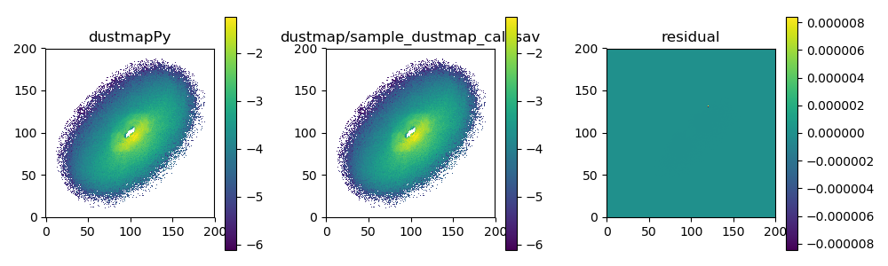

# dustmapPy

A python interface to the C code underlying Chris Stark's dustmap IDL debris disk modeling code.

Depends on [cython](http://docs.cython.org/en/latest/).

Test system configuraton: 

* Cython: 0.26.1
* Python: Python 3.5.4 |Anaconda custom (64-bit)|
* IDL comparison: Version 8.5.1 (linux x86_64 m64)

##  setup:

clone this repo:

    git clone https://github.com/douglase/dustmapPy

clone the [dustmap](https://github.com/douglase/dustmap) repo and add it as a submodule (folder) in your dustmappy directory:

    cd dustmapPy
    git submodule init
    git submodule update

build the repo:

    python setup.py build_ext --inplace

## test and example:


```
python test_map.py
```

Compares the results of an exampled dustmapPy call (Left panel of figure below) to an analogous IDL call of dustmap (middle panel) sample_dustmap_call.pro) which can be found in the dustmap repo and shows the residual (Right panel).




## Contributors:
Python/cython code developed by Ewan Douglas. 

Based on IDL and C dustmap library by Chris Stark, originally posted on http://www.starkspace.com/code/. If you use this code in research, please cite:

Stark, C. C. (2011). The Transit Light Curve of an Exozodiacal Dust Cloud. The Astronomical Journal, 142, 123. https://doi.org/10.1088/0004-6256/142/4/123

