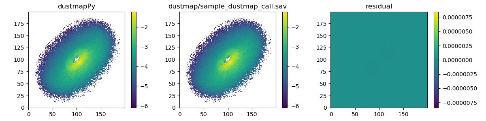

# dustmapPy
python interface to dustmap

Depends on cython.

Test configuration:

## Notes:

Test system configuraton: 

* Cython: 0.26.1
* Python: Python 3.5.4 |Anaconda custom (64-bit)|

##  setup:

clone this repo:

    git clone https://github.com/douglase/dustmapPy

clone the [dustmap](https://github.com/douglase/dustmap) repo and add it as a submodule (folder) in your dustmappy directory:

    cd dustmapPy
    git submodule init
    git submodule update

build the repo:

    python setup.py build_ext --inplace

## test:

Compare the results of an exampled dustmapPy call to an analogous IDL call of dustmap (sample_dustmap_call.pro) which can be found in the dustmap repo.

```
python test_map.py
```


